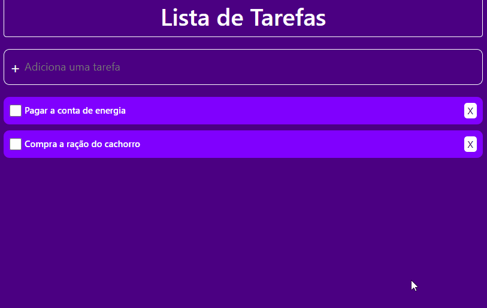

# ToDo List 

Um aplicação simples para gerenciar tarefas. Apesar do baixo nível de complexidade, a aplicação trabalha com conceitos importante do React, typescript e utiliza Styled Components para estilização da página. 

## Funcionamento

## Funcionalidades

<ul>
<li>Adicionar uma nova tarefa</li>
<li>Marcar a tarefa como concluída</li>
<li>Deletar qualquer tarefa</li>
</ul>

## Tecnologias utilizadas

<ul>
<li><a href="https://pt-br.reactjs.org/">ReactJS</a></li>
<li><a href="https://www.typescriptlang.org/">Typescript</a></li>
<li><a href="https://styled-components.com/">Styled Components</a></li>
</ul>

## Autor

Desenvolvido por Jean Pereira da Cruz.   
<a href="https://www.linkedin.com/in/jean-pereira-cruz/">Linkedin</a>

